## Serendipity - About

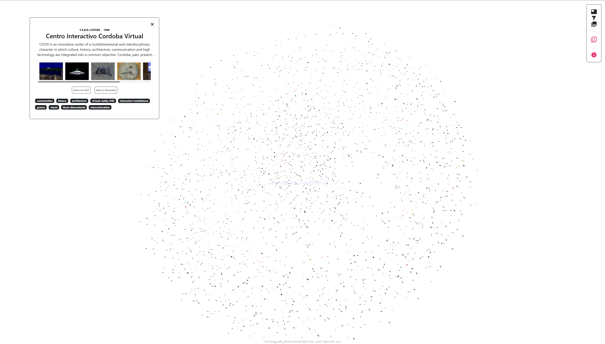

> **Serendipity [ˌsɛ.rɛn.ˈdɪp.ə.ti]**, the faculty or phenomenon of finding valuable or agreeable things not sought for. (Merriam-Webster dictionary)

### What is Serendipity?

Serendipity is an immersive application to playfully arrange, (re)combine, and sort image content from the Archive of Digital Art. Its intention is to provide an archival experience based on exploration and active engagement to support the discovery of new connections and meaningful questions in the field of media art. To achieve these goals, we put our focus on making the potential of the ADA thesaurus with its 600+ terms accessible to users. As artists upload their works themselves on ADA the thesaurus serves as a keyword system for semantic tagging of the content. Serendipity allows the users to filter and display all documented artworks by freely selecting and chaining any of the terms available. They also have the possibility to create many different filter chains for diverse thematical interests. Filtered content is then visually presented in an immersive environment with additional information when hovering over the images. Users can move artworks in a “favorites” section to create their individual collections, which can then be exported to the IIIF viewer Mnemosyne for further analysis and research.

### What is the concept behind?

With the current digital possibilities, we felt like there are primarily two modes of how online archives are approached: Either in a very specific sense, e.g., if people know exactly what they are looking for, or in a very “broad” sense, e.g., when using the amount of available data for meta-analyses. Hence, we were particularly interested in the space in-between the “narrow” view and the bird's-eye perspective, where we imagine the people to discover interesting oddities, strangely fascinating connections, and fresh ideas. This thought process led us to one of the main questions we asked ourselves at the beginning of the project: How could a “stroll” through a digital archive look like? Taking inspiration from Walter Benjamin's flâneur, we further arrived at the idea of “playfulness”, which to us is a particular strength of the digital realm, where content can be quickly shared, combined, recombined, contextualized, and recontextualized. In our mind, strolling through an online archive allows for different modes of engagement with its content and smooth transitions between them. In this sense, Serendipity should encourage a mode of effortless observation and playful combination of content to foster lateral thinking of users in artistic and scientific contexts. The tool Mnemosyne is somewhat a counterpart to Serendipity that represents a mode of focused, analytic, and participatory examination, where looser observations made in Serendipity can be deepened and refined. Thus, the proper integration and connection of these tools were especially important to us, which illustrates an important aspect to us: “Strolling” through an online archive is less a matter of stand-alone tools, but the synergy of various tools that are well embedded in the bigger structure of the online archive environment.

### What are the next steps for Serendipity?

Since Serendipity was developed within a project with limited timespan, we decided to make the code and documentation freely available as a repository on Github. Our hopes are that other institutions and initiatives with large image collections use the tool for their needs and continue to develop the application further. 

#### Possible Todos/Ideas/Fixes

- [ ] Todo 1

## How to Serendipity

Serendipity is a tool to sort, combine and recombine image content from the Archive of Digital Art (ADA). Users can filter the content in the database based on the Thesaurus keywords, which are used for semantic tagging of the artworks. They can also form collections and export them to the image viewer Mnemosyne for closer analysis.

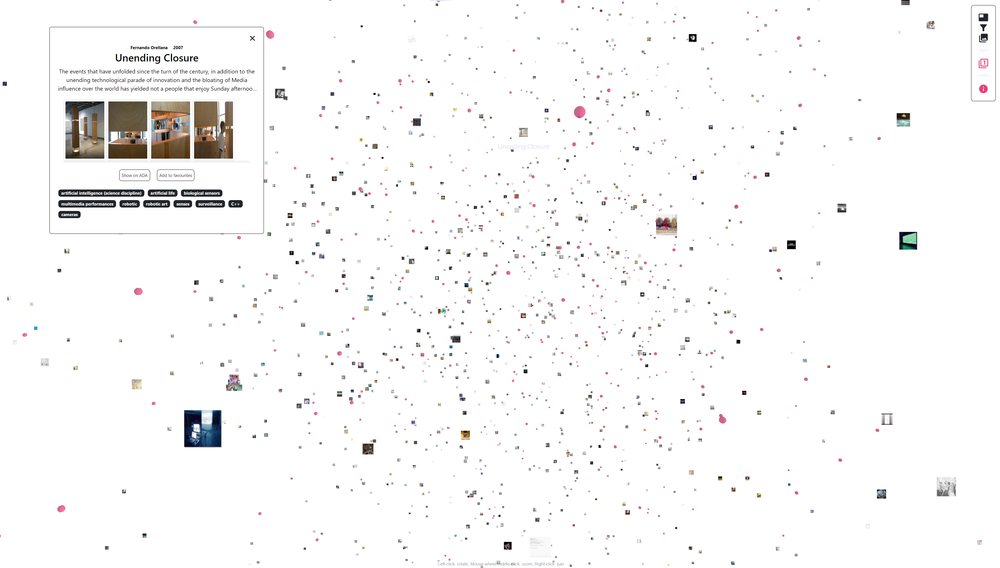

### Main Screen

The main screen depicts the main menu and the artworks, which are chosen based on your filter selections. The default mode without filters shows all the artworks in the database. On the left side of the main screen the chosen keywords and filter chains are indicated.

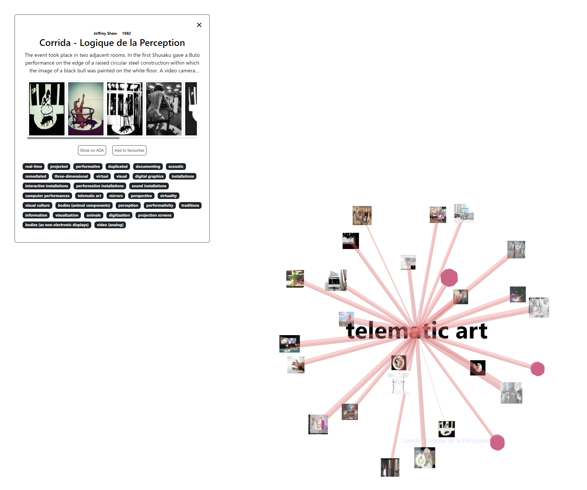

### Main Menu

- **Filters** – opens up the filter section
- **Collections** – opens up your collections
- **Info** – opens up the info section with “About”, “Quick guide”, and “Impressum”

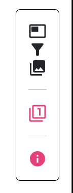

If you hover over any of the images in the main screen you will get additional information on the artworks with the artist name, year of creation, artwork name, description, further images, and the keywords the respective artist chose for this artwork.

**Show on ADA** – takes you to the entry of the artwork on ADA with the full description and other additional information.

**Add to favourites** – transfers the artwork to your collections.

### Filter Chains

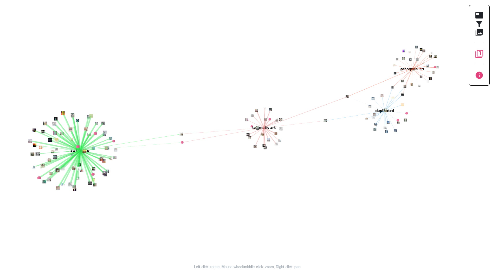

Here you can select Thesaurus keywords to filter the artworks and create various filter chains.

**x** – close filter menu

**List view | Sunburst** – here you can choose between a list view of the Thesaurus keywords or a graphic represention as a sunburst diagram.

Switch the list between an alphabetic and hierarchical view of the Thesaurus.
Add keywords to the respective filter chain(s). It is also possible to create a new filter chain here.

In the sunburst diagram you can left click to enter the different categories. With right click you can add a keyword to the respective filter chain(s) and create new filter chains.

- Allows you to add a new filter chain
- Delete the whole filter chain
- Name your filter chain individually
- Mute this filter chain in the main screen. The filter chain    will not be displayed. Allows you to quickly switch and compare filter chains.
- Remove keywords in the filter chain or move it to another filter chain. Here you can also add all the terms of the Thesaurus that are associatively connected to a certain keyword. It is a quick way to find connections and thematically close artworks.

**Note:** If you add more than one keyword in one filterchain it basically functions as an “and” condition. Artworks must have all the keywords that are selected in one filterchain. If you want the condition to be “or” then you have to create separate filter chains. 

> [!example]
> If you create a filter chain with the terms “media” and “access” you will get artworks that are tagged with both keywords. If you create two filter chains, one with “media” and one with “access”, then you get in one chain all the artworks tagged with “media” and in the other all artworks tagged with “access”. In the latter case the artworks with both terms are of course a subset of the larger set.

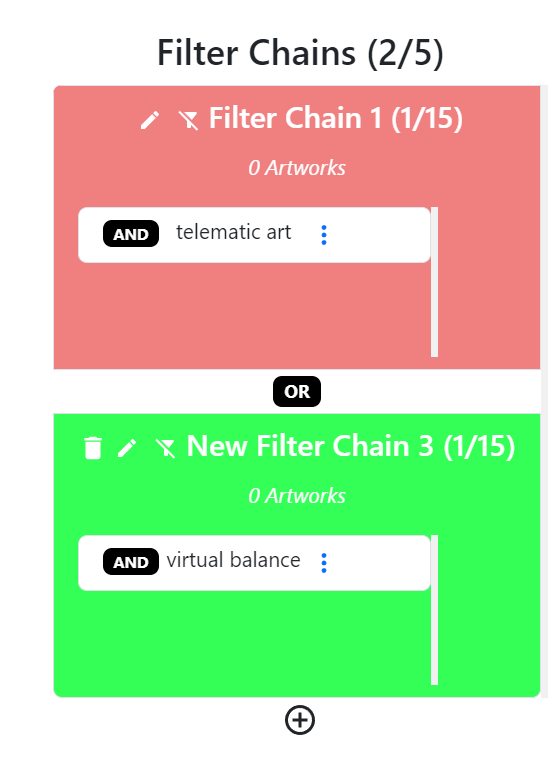

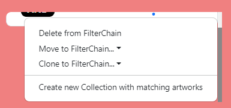

#### Filter Display Algorithms

You have the option to choose between algorithms for visualizing the filterchains. By default the keyword-to-artwork chaining alogrithm is enabled.

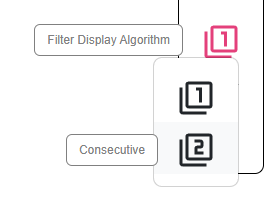

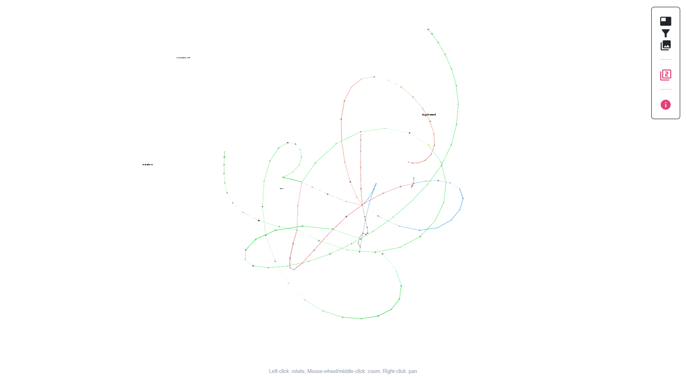

### Collections 

In this menu you can form an manage your collections. Once you added a desired artwork to your favourites you can start forming your collections.

The favourite section is default and acts as a pool for your chosen artworks. From this pool you can form your collections.

Add a collection
Name the collection
Delete Collection

Add artworks to collections, move to another collection, delete from collection/favourites

Export collection to the Mnemosyne viewer for further analysis

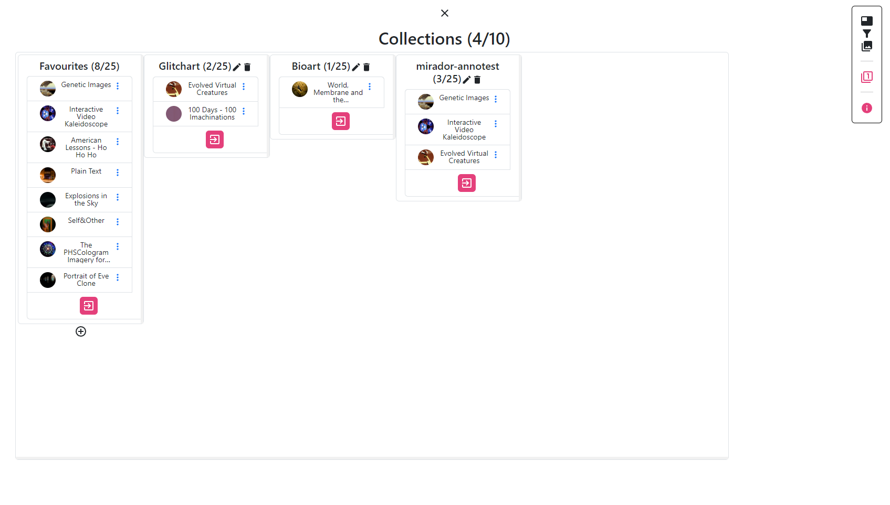

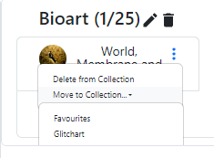

## Credits

Serendipity was developed within the project **“Tool Development for Image Data Literacy: Understanding Digital Art with complex data analysis”**, which was funded by the state of Lower Austria as part of the RTI strategy and the EFRE program.

### Project team

- Fabian Schober (@schobernoise) - Serendipity Main Developer
- Paolo Schmidt (@agentcole) - Mirador Main Developer
- Alexander Wöran - Serendipity Concept and Research
- Laura Ettel - Serendipity Concept and Research
- Isabella Iskra - Scientific Researcher
### Project leads

- Prof. Dr. habil. Dr. hc Oliver Grau, MAE (until June 2022)
- Dr. Viola Rühse, M.A. (from July 2022 until December 2023)
### Technical Advisors

- Jan Victor Schuster (@jan-victor)
- Michael Perl (@mrthnkwn)
- Max Resch (@mxre)